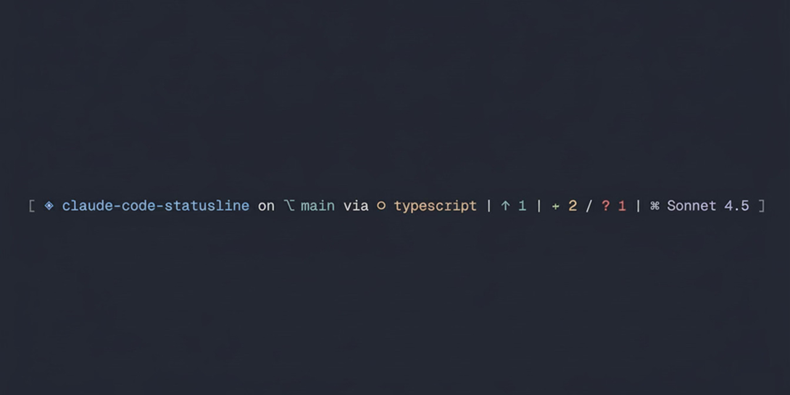

# create-claude-statusline

[](https://www.npmjs.com/package/create-claude-statusline)
[](LICENSE)

Claude Code's built-in statusline is minimal. I wanted project name, git branch, framework, runtime, commit status, and the current model visible at all times. So I built a customizable one with a single config file for toggles, colors, and icons.

Beautiful, customizable status line for Claude Code with granular control over every element.

<picture>
  <source srcset=".github/assets/claude-code-statusline-promo.gif" type="image/gif">
  
</picture>

## What you get

```
[ ◈ my-project on ⎇ main via ◉ React (node) | ↑ 2 / + 1 / ~ 3 / ? 2 | ⌘ Sonnet 4.5 ]
```

- Project name, git branch, framework, runtime
- Commit status (ahead/behind)
- Git indicators (staged, modified, untracked)
- Current Claude model
- Toggle any element, swap colors, swap icons

## Install

```bash
npm create claude-statusline           # npm
pnpm dlx create-claude-statusline      # pnpm
bunx create-claude-statusline          # bun
npx create-claude-statusline           # npx
```

Global with alias:

```bash
npm install -g create-claude-statusline
ccs
```

## Customize

Edit `.claude/scripts/statusline-config.cjs`:

### Toggles

```javascript
FEATURES: {
  SHOW_PROJECT: true,
  SHOW_GIT_BRANCH: true,
  SHOW_FRAMEWORK: true,
  SHOW_RUNTIME: true,
  SHOW_GIT_AHEAD: true,
  SHOW_GIT_BEHIND: true,
  SHOW_GIT_STAGED: true,
  SHOW_GIT_MODIFIED: true,
  SHOW_GIT_UNTRACKED: true,
  SHOW_MODEL: true,
}
```

### Colors (ANSI 256)

```javascript
COLORS: {
  PROJECT: '\x1b[38;5;110m',
  BRANCH: '\x1b[38;5;109m',
  FRAMEWORK: '\x1b[38;5;145m',
  RUNTIME: '\x1b[38;5;180m',
  GIT_AHEAD: '\x1b[38;5;109m',
  GIT_BEHIND: '\x1b[38;5;167m',
  GIT_STAGED: '\x1b[38;5;108m',
  GIT_MODIFIED: '\x1b[38;5;180m',
  GIT_UNTRACKED: '\x1b[38;5;167m',
  MODEL: '\x1b[38;5;146m',
}
```

### Icons

```javascript
ICONS: {
  PROJECT: '◈',
  BRANCH: '⎇',
  GIT_AHEAD: '↑',
  GIT_BEHIND: '↓',
  GIT_STAGED: '+',
  GIT_MODIFIED: '~',
  GIT_UNTRACKED: '?',
  MODEL: '⌘'
}
```

## Detected frameworks and runtimes

**Frameworks**: Next.js, Nuxt.js, NestJS, React, Vue, Angular, Svelte, Express, Fastify

**Runtimes**: Node.js, Bun, TypeScript, Python, Rust, Go, Java, C/C++

## Safety

Your existing `.claude` directory is backed up to `.create-claude-statusline-backup-[timestamp]` before installation.

## Uninstall

```bash
rm -rf .claude/scripts/statusline*.cjs
```

Remove the `"statusLine"` section from `.claude/settings.local.json`.

## License

MIT
